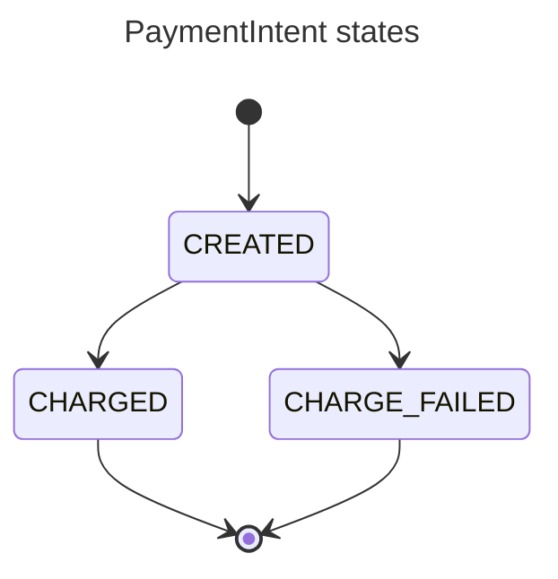
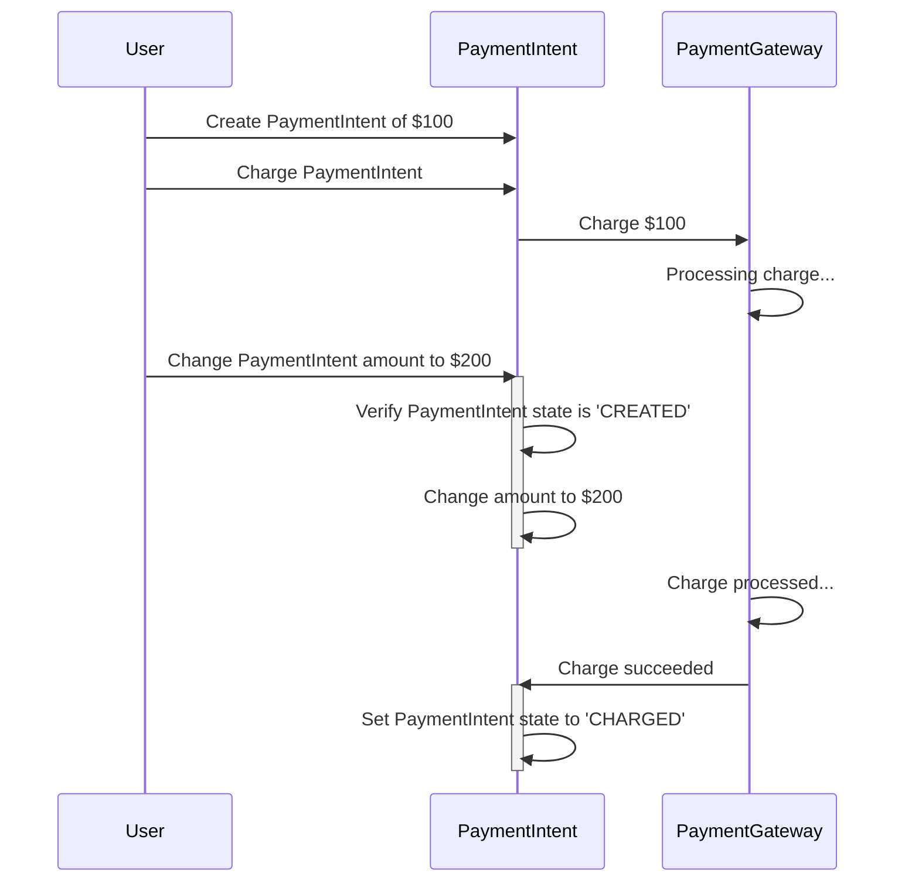
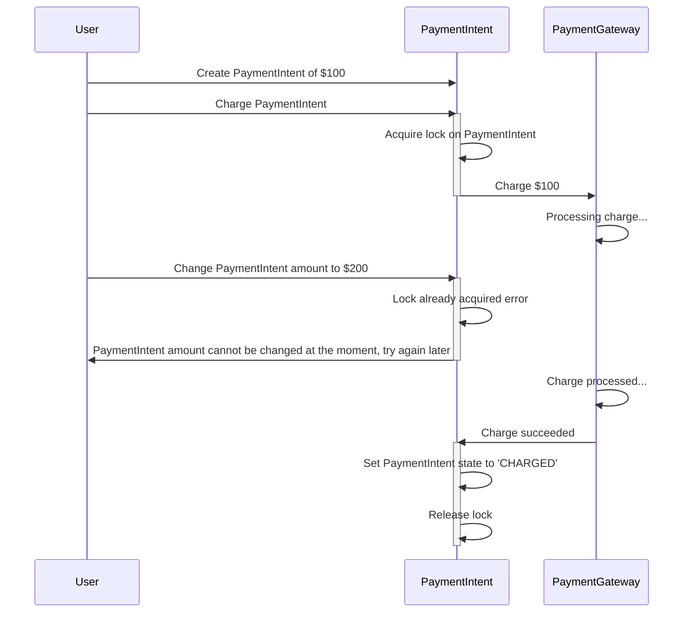

# Concurrency Control and Database Locks with DynamoDB

Concurrency control ensures that concurrent operations are executed correctly and with optimal performance.
The concurrency control mechanisms are necessary in a system that allows concurrent writes to the same resources.
Such systems are, for example, web applications where reads and writes (`GET` and `POST` requests) are executed in separate requests and database transactions.

A business operation might span multiple database transactions,
but [ACID](https://en.wikipedia.org/wiki/ACID) guarantees are provided only within a single database transaction.
Keeping an open database transaction across multiple HTTP requests is not feasible because the database
will hold locks on records for a long time, impacting performance and scalability.

To prevent data corruption anomalies such as lost updates, application-level concurrency control mechanisms become mandatory.

## Example Application - Payments System

We'll explore application-level concurrency control mechanisms in the fictional Payment System example. The example application code is in [src/](src/), and their tests in the [tests/](tests/) directories.

In the Payment System, the user can create a `PaymentIntent` - an entity for managing a payment's lifecycle.
The user creates a `PaymentIntent` when they want to pay for some product or service.
The user can change the `PaymentIntent`'s amount or proceed with the checkout to initiate the charge operation.
The actual charge operation is performed by an external service - the Payment Gateway.

As a datastore, we'll use [DynamoDB](https://aws.amazon.com/dynamodb/) - NoSQL key-value database.
The same principles of application-level concurrency control can be applied to most databases - relational or NoSQL.
Using a distributed NoSQL database like DynamoDB in this example will showcase some interesting aspects of managing concurrency and eventual consistency.


The `PaymentIntent` has three states:

- `CREATED` - the initial state; amount change is possible only when the `PaymentIntent` is in this state.

- `CHARGED` - the Payment Gateway has successfully withdrawn funds from the user's account; changing the `PaymentIntent` amount is no longer possible.

- `CHARGE_FAILED` - Payment Gateway failed to charge the user, for example, due to insufficient funds on the user's account.



## Concurrent Operation Example - Charge and Change Amount

Let's see what can happen when two concurrent operations are performed without additional concurrency control measures.

In the example, a user creates a `PaymentIntent` of $100, initiates the charge operation,
and simultaneously changes the amount to $200, for examples, by quickly adding a new item to a shopping card.
Since the charge involves an external service, the Payment Gateway, it takes more time to complete than
changing the amount. While processing the $100 charge, the amount has been changed to $200.
When the successful charge response arrives from the Payment Gateway, the `PaymentIntent` is marked as `CHARGED`.
In the end, the $200 `PaymentIntent` is marked as `CHARGED` in the Payment System, while only $100 was withdrawn from the user's account.



## Concurrency Control Mechanisms

There are two application-level concurrency control mechanisms: pessimistic and optimistic locking.
The former implements conflict avoidance and the latter - conflict detection.

### Pessimistic Locking with Two-Phase Lock

> [!NOTE]
> Application code: [src/pessimistic_payments/](src/pessimistic_payments/)
>
> Application tests: [tests/pessimistic_payments/](tests/pessimistic_payments/)
>
> DynamoDB pessimistic lock implementation: [src/database_locks/](src/database_locks/)
>
> DynamoDB pessimistic lock tests: [tests/database_locks/](tests/database_locks/)

The pessimistic locking assumes that conflicts will happen and tries to prevent them by acquiring a unique lock on a resource before attempting to modify it.

To ensure that no other concurrent request will modify the data, only one actor (user, HTTP request, etc.) can hold the lock at the same time.
An exception is raised if the lock is already acquired, and the caller must determine an appropriate retry strategy -
pause the request and retry later, usually with exponential backoff, or fail the request and let the caller retry.
After acquiring the lock, it's essential to query the latest instances of the objects from the datastore to ensure that
business decisions will be made on the most recent data. In eventually consistent databases like DynamoDB it will
require the use of [strongly consistent reads](https://docs.aws.amazon.com/amazondynamodb/latest/developerguide/HowItWorks.ReadConsistency.html).

In the [two-phase locking](https://en.wikipedia.org/wiki/Two-phase_locking) protocol, the locks are acquired and released in two phases:

1. Expanding phase - locks are acquired, and no locks are released.
2. Shrinking phase - locks are released, and no other lock is further acquired.

The two basic types of two-phase locks are:

- Shared (read) lock - prevents a record from being written while allowing reads.
- Exclusive (write) lock - prevents both reads and writes.

Using pessimistic locking, we can resolve the problem with concurrent "charge and change amount" requests.
In this example, the "Charge `PaymentIntent`" request acquires a lock on the `PaymentIntent` before attempting to initiate the charge request,
ensuring that no other request is currently modifying the `PaymentIntent` at the same time.
The concurrent "Change `PaymentIntent` amount" request failed because it could not acquire the lock.



#### Two-Phase Lock with DynamoDB

DynamoDB doesn't provide pessimistic locking out of the box; however, the implementation is straightforward.
The example implementation is in the [src/database_locks/pessimistic_lock.py](src/database_locks/pessimistic_lock.py),
and the tests are in [tests/database_locks/test_dynamodb_pessimistic_lock.py](tests/database_locks/test_dynamodb_pessimistic_lock.py).

```python
from database_locks import DynamoDBPessimisticLock
from pessimistic_payments.repository import DynamoDBPaymentIntentRepository

lock = DynamoDBPessimisticLock(dynamodb_client, table_name="payment-intents")

repository = DynamoDBPaymentIntentRepository(dynamodb_client, table_name="payment-intents")

# Content manager acquires a lock on DynamoDB item on enter and releases the lock on exit
async with lock(key={"PK": {"S": f"PAYMENT_INTENT#{payment_intent_id}"}, "SK": {"S": "#PAYMENT_INTENT"}}):
    # Get the fresh instance of the item after aquiring the lock to ensure you're working with latest data
    # Requires use of DynamoDB's strongly consistent read to prevent getting stale data
    payment_intent = await repository.get("pi_123456")

    await payment_intent.execute_charge(payment_gateway)
    ...
```

The lock can be set to expire with the `lock_timeout` parameter. It might be useful to enable automatic retries in case of unreleased locks,
e.g., in case of temporary DynamoDB error or ungraceful application shutdown.

```python
from datetime import timedelta

from database_locks import DynamoDBPessimisticLock

lock = DynamoDBPessimisticLock(
    dynamodb_client,
    table_name="payment-intents",
    lock_timeout=timedelta(minutes=30),
)
```

The `DynamoDBPessimisticLock` implementation can be hidden away in the `PaymentIntentRepository`,
while keeping the usage of locks explicit in the client code.

```python
from pessimistic_payments.repository import DynamoDBPaymentIntentRepository

repository = DynamoDBPaymentIntentRepository(dynamodb_client, "payment-intents")

async with repository.lock("pi_123456") as payment_intent:
    await payment_intent.execute_charge(payment_gateway)
    ...
```

Now, we can test that the application's use cases are executed one at a time;
for example, two concurrent `charge_payment_intent` requests result in only one call to the Payment Gateway.
The tests are unaware that the pessimistic locks are used for concurrency control, so the implementation details are not exposed.

```python
from pessimistic_payments.use_cases import charge_payment_intent, create_payment_intent

@pytest.mark.asyncio()
async def test_payment_intent_charged_once(repo: PaymentIntentRepository) -> None:
    payment_intent = await create_payment_intent("cust_123456", 100, "USD", repo)
    payment_gw_mock = Mock(spec_set=PaymentGateway)
    payment_gw_mock.charge.return_value = PaymentGatewayResponse(id="ch_123456")

    await asyncio.wait(
        [
            asyncio.create_task(charge_payment_intent(payment_intent.id, repo, payment_gw_mock)),
            asyncio.create_task(charge_payment_intent(payment_intent.id, repo, payment_gw_mock)),
        ]
    )

    payment_gw_mock.charge.assert_awaited_once()
```

#### Drawbacks of Pessimistic Locking

TODO

### Optimistic Locking with Incrementing Version Number and Semantic Lock

> [!NOTE]
> Application code: [src/optimistic_payments/](src/optimistic_payments/)
>
> Application tests: [tests/optimistic_payments/](tests/optimistic_payments/)

TODO

## Draft

- [ ] Shifting concurrency control concerns to the infrastructure layer, making
      the business logic unaware of concurrent execution.
      From the perspective of the business logic, it always runs in a serial manner

- [ ] Moving **some parts** of the concurrency control to the business logic layer
      to optimize parts of the system and achieve higher throughput, improve user experience, and scalability.

- [ ] Other approaches

  - [ ] Idempotence in general

    - Explicit idempotence key
    - Assembling idempotence key on the consumer side from the received data
    - [ ] Throw error or return the same response? Probably returning the same response.

  - [ ] Ordering operations to achieve idempotence and concurrency control

## Resources

- Article: [Optimistic vs. Pessimistic Locking](https://vladmihalcea.com/optimistic-vs-pessimistic-locking/)

- Article: [A beginner’s guide to Serializability](https://vladmihalcea.com/serializability/)

- Article: [How to prevent lost updates in long conversations](https://vladmihalcea.com/preventing-lost-updates-in-long-conversations/)

- Talk: [Vlad Mihalcea - Transactions and Concurrency Control Patterns](https://www.youtube.com/watch?v=2qXJI7kG1ig).

- Book: "Transactions" chapter from [High-Performance Java Persistence Book](https://vladmihalcea.com/books/high-performance-java-persistence/);
  the chapter is available for free download by subscribing to the email newsletter at the end of [this](https://vladmihalcea.com/preventing-lost-updates-in-long-conversations/) article.

- Article: [Implementing Pessimistic Locking with DynamoDB and Python](https://www.tecracer.com/blog/2022/10/implementing-pessimistic-locking-with-dynamodb-and-python.html)

- Article: [Implementing optimistic locking in DynamoDB with Python](https://www.tecracer.com/blog/2021/07/implementing-optimistic-locking-in-dynamodb-with-python.html)

- Article: [Implement resource counters with Amazon DynamoDB](https://aws.amazon.com/blogs/database/implement-resource-counters-with-amazon-dynamodb/)
