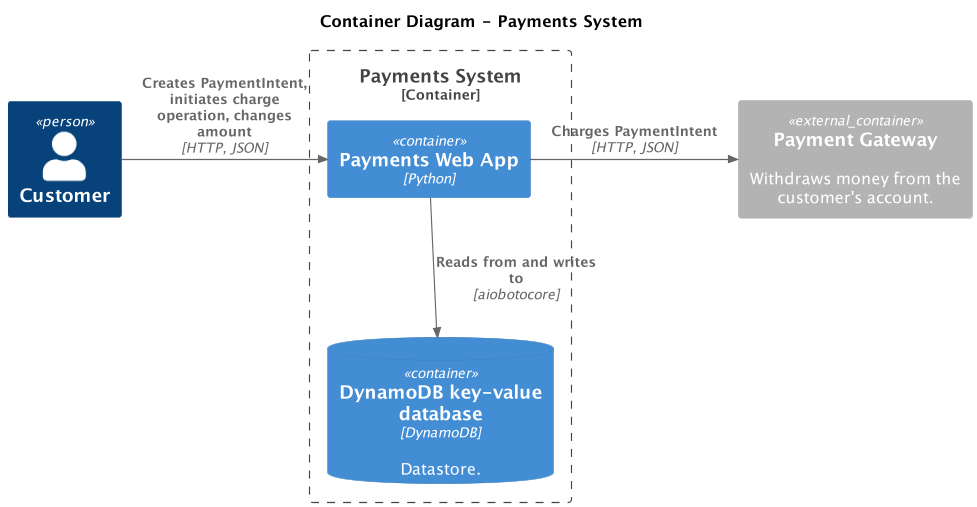
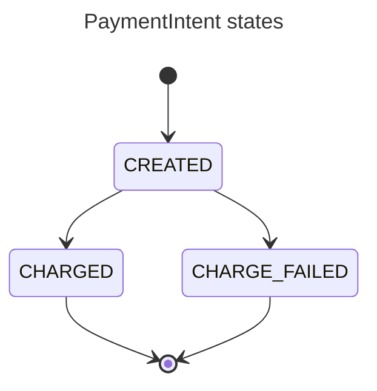
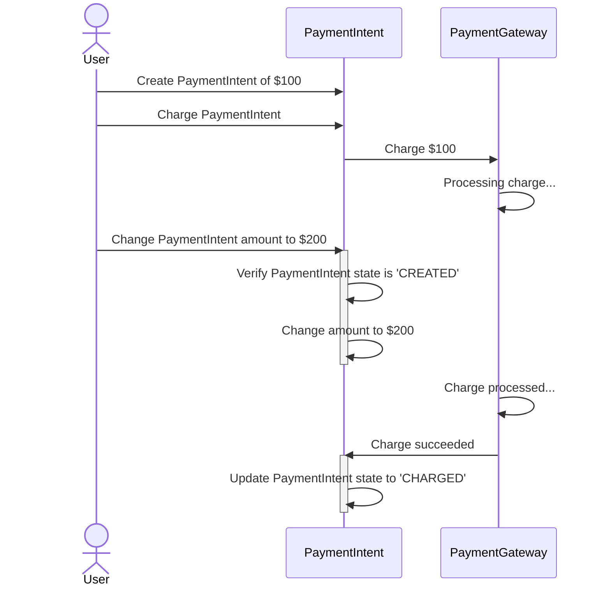
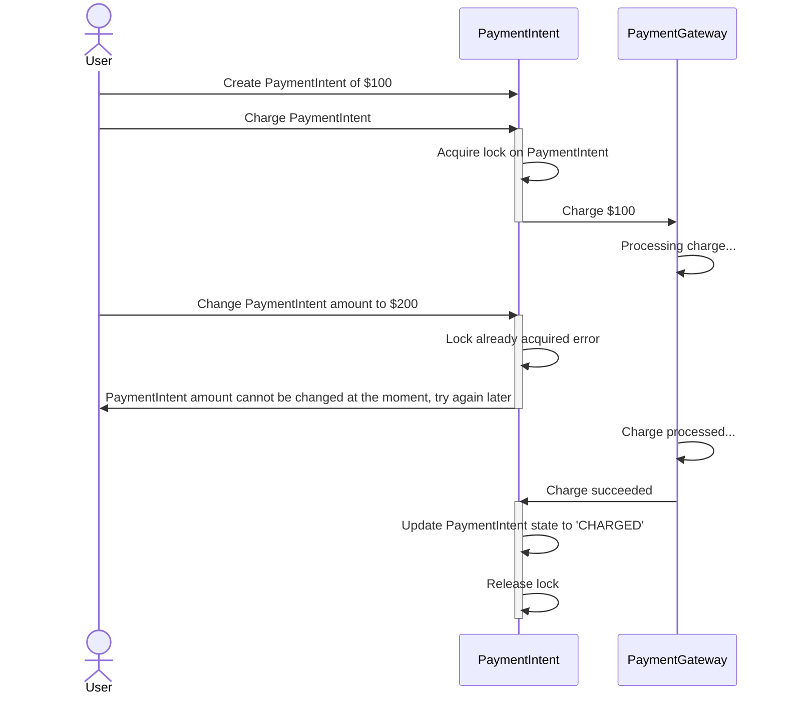
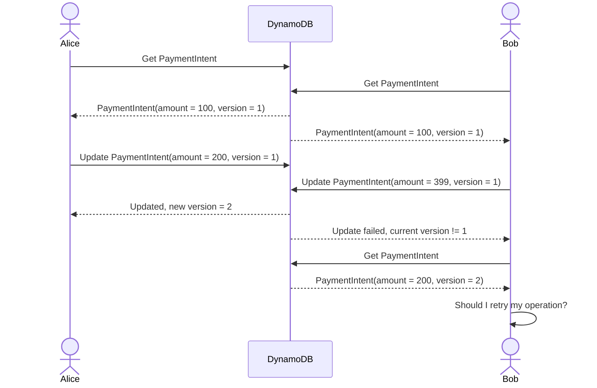
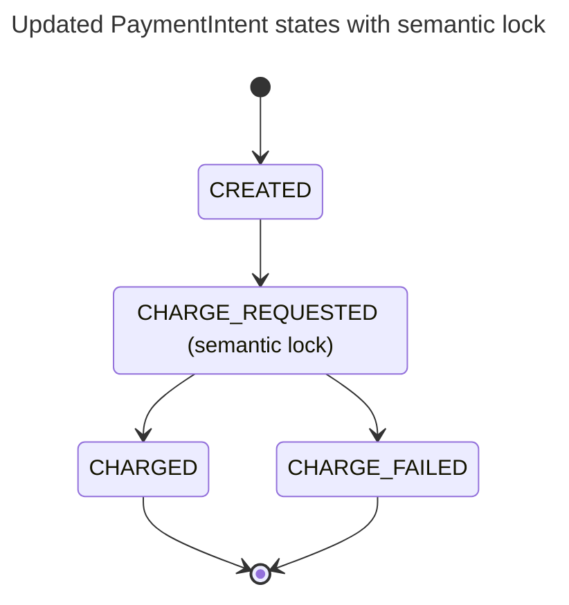
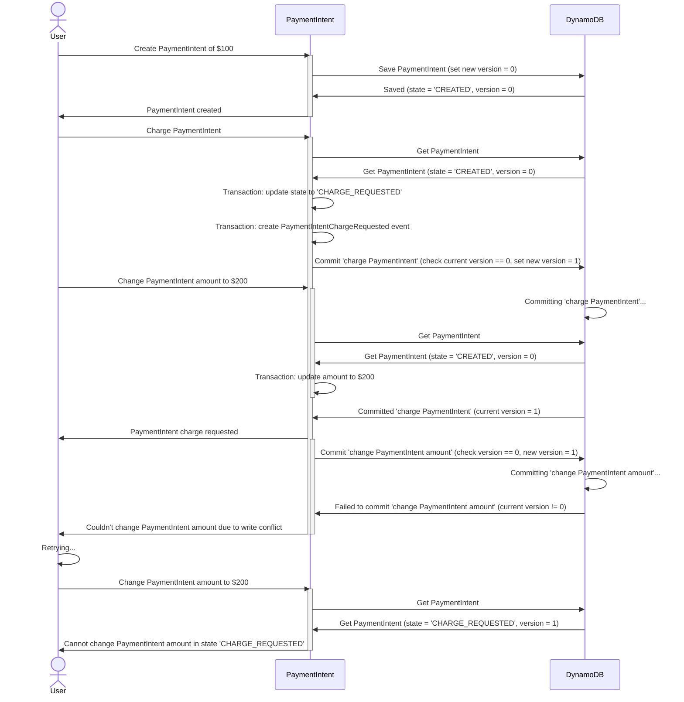

# Concurrency Control and Database Locks with DynamoDB

Concurrency control ensures that concurrent operations are executed correctly and with optimal performance.
The concurrency control mechanisms are necessary in a system that allows concurrent writes to the same resources.
Such systems are, for example, web applications where reads and writes (`GET` and `POST` requests)
are executed in separate requests and database transactions.

A business operation might span multiple database transactions,
but [ACID](https://en.wikipedia.org/wiki/ACID) guarantees are provided only within a single database transaction.
Keeping an open database transaction across multiple HTTP requests is not feasible because the database
will hold locks on records for a long time, impacting performance and scalability.

To prevent data corruption anomalies such as lost updates, application-level concurrency control mechanisms become mandatory.

- [Concurrency Control and Database Locks with DynamoDB](#concurrency-control-and-database-locks-with-dynamodb)
  - [Example Application - Payments System](#example-application---payments-system)
  - [Concurrent Operation Example - Charge and Change Amount](#concurrent-operation-example---charge-and-change-amount)
  - [Concurrency Control Mechanisms](#concurrency-control-mechanisms)
    - [Pessimistic Locking with Two-Phase Lock](#pessimistic-locking-with-two-phase-lock)
      - [Two-Phase Lock with DynamoDB](#two-phase-lock-with-dynamodb)
      - [Two-Phase Lock with Relational Databases](#two-phase-lock-with-relational-databases)
      - [Drawbacks of Pessimistic Locking](#drawbacks-of-pessimistic-locking)
    - [Optimistic Locking with Incrementing Version Number](#optimistic-locking-with-incrementing-version-number)
      - [Optimistic Locking in Distributed Transactions](#optimistic-locking-in-distributed-transactions)
      - [Applying Optimistic Locking to the Payments System Example](#applying-optimistic-locking-to-the-payments-system-example)
      - [Optimistic Locking with DynamoDB](#optimistic-locking-with-dynamodb)
      - [Optimistic Locking with Relational Databases](#optimistic-locking-with-relational-databases)
  - [Note on API Idempotence](#note-on-api-idempotence)
  - [Resources](#resources)
    - [Concurrency Control](#concurrency-control)
    - [DynamoDB](#dynamodb)
    - [Distributed Transactions](#distributed-transactions)
    - [Retries](#retries)
    - [API Idempotence](#api-idempotence)

## Example Application - Payments System

We'll explore application-level concurrency control mechanisms in the fictional Payments System example.
The example application code is in [src/](src/), and their tests are in the [tests/](tests/) directories.

In the Payments System, a user can create a `PaymentIntent` - an entity for managing a payment's lifecycle.
The user creates a `PaymentIntent` when they want to pay for some product or service.
The user can change the `PaymentIntent`'s amount or proceed with the checkout that initiates the charge operation.
The actual charge operation is performed by an external service - the Payment Gateway.

As a datastore, we'll use [DynamoDB](https://aws.amazon.com/dynamodb/) - NoSQL key-value database.
The same principles of application-level concurrency control can be applied to most databases - relational or NoSQL.
Using a distributed NoSQL database like DynamoDB in this example will showcase
some interesting aspects of managing concurrency and eventual consistency.



The `PaymentIntent` has three states:

- `CREATED` - the initial state; amount change is possible only when the `PaymentIntent` is in this state.

- `CHARGED` - the Payment Gateway has successfully withdrawn funds from the user's account;
  changing the `PaymentIntent` amount is no longer possible.

- `CHARGE_FAILED` - Payment Gateway failed to charge the user, for example, due to insufficient funds on the user's account.



## Concurrent Operation Example - Charge and Change Amount

Let's see what can happen when two concurrent operations are performed without additional concurrency control measures.

In the example, a user creates a `PaymentIntent` of $100, initiates the charge operation,
and simultaneously changes the amount to $200, for example, by quickly adding a new item to a shopping card.
Since the charge involves an external service, the Payment Gateway, it takes longer to complete than changing the amount.
While processing the $100 charge, the amount has been changed to $200.
When the successful charge response arrives from the Payment Gateway, the `PaymentIntent` is marked as `CHARGED`.
In the end, the $200 `PaymentIntent` is marked as `CHARGED` in the Payments System,
while only $100 was withdrawn from the user's account.



## Concurrency Control Mechanisms

There are two application-level concurrency control mechanisms: pessimistic and optimistic locking.
The former implements conflict avoidance and the latter - conflict detection.

The following examples will implement the pessimistic and optimistic locking inside a Repository (infrastructure layer).
The [Repository](https://martinfowler.com/eaaCatalog/repository.html) is an abstraction over the data access layer
that hides the mechanics of a particular database technology and provides a clean interface for
querying and persisting business objects.

Encapsulating the concurrency control mechanisms inside the Repository has the advantage
of hiding the complexity of concurrency control from the business logic code.
This way, from the domain layer point of view, concurrency doesn't exist -
when the code is running, it assumes it's the only running process at that time.
It simplifies the domain layer code and makes it less cluttered with infrastructure concerns.

Concurrency control mechanisms add overhead to the database layer -
additional reads, writes, and conditional checks. Therefore, the downside of encapsulating concurrency control
inside the Repository is that the concurrency control will always be used on database writes,
including scenarios where data write conflicts can't occur due to how the application and business logic are designed.
In that case, the additional resources spent on ensuring data correctness are wasted,
rendering the system less performant and more resource-intensive.

Another approach to concurrency control is to apply it selectively where necessary or omit it altogether.
In some use cases, it's possible to order a system's operations and design business objects
in a way that minimizes or eliminates concurrency conflicts. Shifting some concurrency control mechanisms
to the domain layer can help optimize necessary parts of the application. This approach is useful
in high-performance and low-latency systems, where additional performance overhead of traditional
pessimistic and optimistic concurrency control mechanisms is intolerable.
This excellent talk about [eventual consistency](https://www.infoq.com/presentations/eventual-consistent/)
by Susanne Braun gives many practical examples of designing systems in the context of
distributed systems and eventual consistency.

### Pessimistic Locking with Two-Phase Lock

> [!NOTE]
> Application code: [src/pessimistic_payments/](src/pessimistic_payments/)
>
> Application tests: [tests/pessimistic_payments/](tests/pessimistic_payments/)
>
> DynamoDB pessimistic lock code: [src/database_locks/](src/database_locks/)
>
> DynamoDB pessimistic lock tests: [tests/database_locks/](tests/database_locks/)

The pessimistic locking assumes that conflicts will happen and prevents them
by acquiring a unique lock on a resource before attempting to modify it.
The pessimistic lock is usually used in cases where conflicts are bound to happen due to high contention
or where retry operations are expensive.

To ensure that no other concurrent request will modify the data, only one actor (user, HTTP request)
can hold the lock at the same time. Because only one request can modify a resource at a time,
pessimistic locking results in a throughput penalty.

An exception is raised if the lock is already acquired, and the caller must determine an appropriate
[retry strategy](https://encore.dev/blog/retries) - pause the request and retry later, usually with exponential backoff,
or fail the request and let the caller retry.

After acquiring the lock, it's essential to query the latest instances of the objects from the datastore again
to ensure that business decisions will be made on the most recent data.
In distributed and eventually consistent databases like DynamoDB it will require the use of
[strongly consistent reads](https://docs.aws.amazon.com/amazondynamodb/latest/developerguide/HowItWorks.ReadConsistency.html).

In the [two-phase locking](https://en.wikipedia.org/wiki/Two-phase_locking) protocol,
the locks are acquired and released in two phases:

1. Expanding phase - locks are acquired, and no locks are released.
2. Shrinking phase - locks are released, and no other lock is further acquired.

The two basic types of two-phase locks are:

- Shared (read) lock - prevents a record from being written while allowing reads.
- Exclusive (write) lock - prevents both reads and writes.

Using pessimistic locking, we can resolve the problem with concurrent "charge and change amount" requests.
In this example, the "charge `PaymentIntent`" request acquires a lock on the `PaymentIntent` before attempting
to initiate the charge request, ensuring that no other request is currently modifying the `PaymentIntent` at the same time.
The "change `PaymentIntent` amount" request failed because it could not acquire the lock.



#### Two-Phase Lock with DynamoDB

DynamoDB doesn't provide pessimistic locking out of the box, so it needs to be implemented manually.
The example implementation is in the [src/database_locks/pessimistic_lock.py](src/database_locks/pessimistic_lock.py),
and the tests are in [tests/database_locks/test_dynamodb_pessimistic_lock.py](tests/database_locks/test_dynamodb_pessimistic_lock.py).

> [!NOTE]
> Your database might already implement pessimistic locking out of the box,
> so you don't need to write your own implementation.
> For example, see the [Two-Phase Lock with Relational Databases](#two-phase-lock-with-relational-databases),
> and check your databases documentation.

```python
from database_locks import DynamoDBPessimisticLock
from pessimistic_payments.repository import DynamoDBPaymentIntentRepository

lock = DynamoDBPessimisticLock(dynamodb_client, table_name="payment-intents")

repository = DynamoDBPaymentIntentRepository(dynamodb_client, table_name="payment-intents")

# Content manager acquires a lock on a DynamoDB item on enter and releases the lock on exit
async with lock(
    key={
        "PK": {"S": f"PAYMENT_INTENT#{payment_intent_id}"},
        "SK": {"S": "#PAYMENT_INTENT"},
    }
):
    # Query the fresh instance of the item to ensure you're working with latest data
    # Requires use of DynamoDB's strongly consistent read to prevent querying stale data
    payment_intent = await repository.get("pi_123456")

    await payment_intent.execute_charge(payment_gateway)
    ...
```

The lock can be set to expire with the `lock_timeout` parameter.
It might be useful to support automatic retries in case of unreleased locks, e.g.,
in case of a temporary DynamoDB error or application crash.
The timeout can be aligned with HTTP request timeout; for example, if a web application
is configured to time-out requests executing, for example, longer than 3 minutes,
a 5-minute timeout on the lock will ensure that it's safe to release the lock.

```python
from datetime import timedelta

from database_locks import DynamoDBPessimisticLock

lock = DynamoDBPessimisticLock(
    dynamodb_client,
    table_name="payment-intents",
    lock_timeout=timedelta(minutes=5),
)
```

The `DynamoDBPessimisticLock` implementation can be hidden away in the `PaymentIntentRepository`
while keeping the usage of locks explicit in the client code.

```python
from pessimistic_payments.repository import DynamoDBPaymentIntentRepository

repository = DynamoDBPaymentIntentRepository(dynamodb_client, "payment-intents")

async with repository.lock("pi_123456") as payment_intent:
    await payment_intent.execute_charge(payment_gateway)
    ...
```

Now, we can test that the application's use cases are executed one at a time;
for example, two concurrent `charge_payment_intent` requests result in only one call to the Payment Gateway.
The tests are unaware that the pessimistic locks are used for concurrency control, so this implementation detail is not exposed.

```python
from pessimistic_payments.use_cases import charge_payment_intent, create_payment_intent

@pytest.mark.asyncio()
async def test_payment_intent_charged_once(repo: PaymentIntentRepository) -> None:
    payment_intent = await create_payment_intent("cust_123456", 100, "USD", repo)
    payment_gw_mock = Mock(spec_set=PaymentGateway)
    payment_gw_mock.charge.return_value = PaymentGatewayResponse(id="ch_123456")

    await asyncio.wait(
        [
            asyncio.create_task(charge_payment_intent(payment_intent.id, repo, payment_gw_mock)),
            asyncio.create_task(charge_payment_intent(payment_intent.id, repo, payment_gw_mock)),
        ]
    )

    payment_gw_mock.charge.assert_awaited_once()
```

#### Two-Phase Lock with Relational Databases

Most relational databases already offer the possibility of manually acquiring a shared or exclusive lock.
For example, in PostgreSQL, you can use `SELECT FOR UPDATE` within a transaction to acquire an exclusive lock on a row level.
Read more about explicit locking in PostgreSQL at <https://www.postgresql.org/docs/current/explicit-locking.html>.

```sql
BEGIN;

SELECT id, state, customer_id, amount, currency
FROM payment_intents
WHERE id = 'pi_123456'
FOR UPDATE; -- acquires an exclusive lock and prevents other transactions from reading and modifying the row

UPDATE payment_intents SET state = 'CHARGED' WHERE id = 'pi_123456';

COMMIT;
```

#### Drawbacks of Pessimistic Locking

Since pessimistic locks provide access to a resource modification to a single request at a time,
it results in a performance and throughput penalty. Lock acquisition is a multiple-step process:
acquire a lock, query the objects, and release the lock. While the lock is held,
other requests must wait until the lock is released. It increases contention and latency.
Even if no conflicts would've occurred between the concurrent requests, they still must wait for their turn to acquire the lock.

When using pessimistic locks with DynamoDB, the application can't take advantage of the database's
eventual consistency model. Using pessimistic locking as the primary concurrency control mechanism in DynamoDB
strips away the benefits of using a distributed database. The optimistic concurrency control mechanism,
described in the next section, better aligns with DynamoDB's data modeling approach.

The pessimistic locking still has its use cases when using DynamoDB or any other database,
for example, when concurrency conflicts happen often and the operation is expensive to retry.

### Optimistic Locking with Incrementing Version Number

Optimistic locking is also known as optimistic concurrency control because it doesn't involve any locks at all.

Optimistic concurrency control assumes that write conflicts are unlikely to happen;
it detects if written items have changed since the last read and aborts the transaction.
Unlike pessimistic locking, where the check for other concurrent operations occurs at the beginning of a request by acquiring a lock,
with optimistic locking, the check is shifted to the end - transaction commit.

With optimistic locking, each item is assigned an incrementing version number.
When an item is queried from a database, an application must keep track of the returned version number, e.g., `1`.
When the application wants to modify the item within the same business transaction,
it must add a conditional check to the database's write operation,
checking that the version number is still the same in the database - `1`,
and increment the version number by one - `check current version == 1 AND set new version = 2`.

If the version number is the same, no other concurrent request has modified the item, so it's safe to commit the changes.
If the version number differs, another concurrent request has modified the item,
so it's unsafe to write, and the database transaction must be aborted.
A separate mechanism is required to catch optimistic lock errors and determine an appropriate retry mechanism:
retry automatically with exponential backoff, display an error to the user for taking manual action, or discard the failed operation.



#### Optimistic Locking in Distributed Transactions

Optimistic locking relies on conflict detection and transaction cancellation.
A business transaction must be atomic so that it's possible to rollback when a conflict is detected.
An atomic transaction either succeeds or fails without leaving partial updates.
Transaction atomicity is straightforward when a business transaction only writes to a single local database
without modifying data in external services. Relational databases have ACID transactions,
DynamoDB supports transactions as well, or only a single DynamoDB `PutItem` operation is used.

Atomicity is challenging if a business transaction modifies data in other external services.
For example, as part of the "charge `PaymentIntent`" business transaction,
the Payments System sends a charge request to the Payment Gateway.
The charge request is sent before updating the `PaymentIntent` state in the database,
so if a concurrency conflict is detected and the transaction is canceled,
the `PaymentIntent` is rollbacked to the initial `CREATED` state.
However, the Payment Gateway has already charged the user,
leaving the Payments System and Payment Gateway in an inconsistent state.
This business transaction is not atomic because it can't be easily rollbacked.
Such transactions involving updates in multiple systems are called distributed transactions.

To make a distributed transaction atomic, we can split it into multiple
individually atomic transactions with the [Saga](https://microservices.io/patterns/data/saga.html) pattern.
Read more about the Saga pattern:

- <https://microservices.io/patterns/data/saga.html>
- <https://learn.microsoft.com/en-us/azure/architecture/reference-architectures/saga/saga>

To make individual transactions that compose a Saga atomic, we can use Saga's Semantic Locks with two other patterns:
[Unit of Work](https://martinfowler.com/eaaCatalog/unitOfWork.html) and
[Transactional Outbox](https://microservices.io/patterns/data/transactional-outbox.html).

The Semantic Lock, an application-level lock, indicates that a business object's update is in progress.

The Unit of Work ensures that all data changes are atomically written to a database without concurrency anomalies.
Here, we can apply optimistic locking to resolve concurrency problems and transactions to achieve atomicity.

The Transactional Outbox ensures messages/events are reliably published to a message broker.
Using the Transactional Outbox, the message is first stored in the database as part of the Unit of Work's transaction,
and a separate process reads saved messages from the database and sends them to the message broker.

You can find a complete example of how to apply these patterns in another of my projects:
<https://github.com/filipsnastins/transactional-messaging-patterns-with-aws-dynamodb-streams-sns-sqs-lambda>

#### Applying Optimistic Locking to the Payments System Example

To apply optimistic concurrency control to the Payments System,
we'll create the "charge `PaymentIntent`" Saga consisting of two separate atomic operations:

1. Request the charge by applying the semantic lock that sets the `PaymentIntent` to the `CHARGE_REQUESTED` state
   and publish the `PaymentIntentChargeRequested` event as part of the Unit of Work transaction.

2. Listen to the `PaymentIntentChargeRequested` event, send the charge request to the Payment Gateway,
   and set the `PaymentIntent` state to either `CHARGED` or `CHARGE_FAILED`.



The sequence diagram below simulates how optimistic concurrency control and semantic lock prevent concurrency anomalies
and enforce `PaymentIntent` object's invariants.

First, the user creates a new `PaymentIntent` and then sends the charge request. The charge request queries
the created `PaymentIntent`, checks that it's in the `CREATED` state, applies the semantic lock by
changing the state to `CHARGE_REQUESTED`, and writes the `PaymentIntentChargeRequested` event to the database.
The database writes are wrapped in an atomic DynamoDB transaction.

While the DynamoDB transaction was committing, the user sent a new request to change the `PaymentIntent` amount.
Since the previous transaction hasn't been committed yet, the `PaymentIntent` is still in the `CHARGED` state,
which allows changing the amount. While the application issued another DynamoDB transaction to change the `PaymentIntent` amount,
the first transaction that requested the charge was committed, incrementing optimistic lock's version number by one.
Therefore, the second transaction that changes the amount fails because its version number (`0`)
doesn't match with the current version stored in the database (`1`).
The user can retry changing the amount, but the application will reject the request because
the `PaymentIntent` is now in the `CHARGE_REQUESTED` state that prevents changing the amount.



#### Optimistic Locking with DynamoDB

TODO

#### Optimistic Locking with Relational Databases

TODO

## Note on API Idempotence

TODO ensuring that Payment Gateway's charge API is idempotent to enable safe retries.

## Resources

### Concurrency Control

- Article: [Optimistic vs. Pessimistic Locking](https://vladmihalcea.com/optimistic-vs-pessimistic-locking/)

- Article: [A beginner’s guide to Serializability](https://vladmihalcea.com/serializability/)

- Article: [How to prevent lost updates in long conversations](https://vladmihalcea.com/preventing-lost-updates-in-long-conversations/)

- Talk: [Vlad Mihalcea - Transactions and Concurrency Control Patterns](https://www.youtube.com/watch?v=2qXJI7kG1ig).

- Book: "Transactions" chapter from [High-Performance Java Persistence Book](https://vladmihalcea.com/books/high-performance-java-persistence/);
  the chapter is available for free download by subscribing to the email newsletter at the end of [this](https://vladmihalcea.com/preventing-lost-updates-in-long-conversations/) article.

- Talk: [Eventual Consistency – Don’t Be Afraid!](https://www.infoq.com/presentations/eventual-consistent/)

### DynamoDB

- Article: [Implementing Pessimistic Locking with DynamoDB and Python](https://www.tecracer.com/blog/2022/10/implementing-pessimistic-locking-with-dynamodb-and-python.html)

- Article: [Implementing optimistic locking in DynamoDB with Python](https://www.tecracer.com/blog/2021/07/implementing-optimistic-locking-in-dynamodb-with-python.html)

- Article: [DynamoDB: Optimistic locking with version number](https://docs.aws.amazon.com/amazondynamodb/latest/developerguide/DynamoDBMapper.OptimisticLocking.html)

- Article: [Implement resource counters with Amazon DynamoDB](https://aws.amazon.com/blogs/database/implement-resource-counters-with-amazon-dynamodb/)

### Distributed Transactions

- Article: [Pattern: Saga](https://microservices.io/patterns/data/saga.html)

- Article: [Saga distributed transactions pattern](https://learn.microsoft.com/en-us/azure/architecture/reference-architectures/saga/saga)

- Article: [Pattern: Transactional outbox](https://microservices.io/patterns/data/transactional-outbox.html)

- Example: [Transactional Messaging Patterns - with AWS DynamoDB Streams, SNS, SQS, and Lambda](https://github.com/filipsnastins/transactional-messaging-patterns-with-aws-dynamodb-streams-sns-sqs-lambda)

### Retries

- Article: [Retries: An interactive study of common retry methods](https://encore.dev/blog/retries)

### API Idempotence

- Article: [Designing robust and predictable APIs with idempotency](https://stripe.com/blog/idempotency)

- Article: [Your Lambda function might execute twice. Be prepared!](https://cloudonaut.io/your-lambda-function-might-execute-twice-deal-with-it/)
